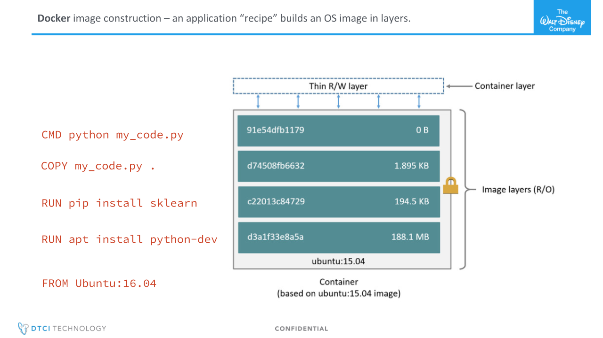

# Intro to Docker and Docker Compose

Docker is a game-changing technology in the world of data science, devops, and running apps in the cloud.
This short guide is meant as an introduction to the core concepts of using docker. It includes some theory and a brief example. The intention is that you will walk away from this ~1 hour module with an understanding of what docker is, and a starting point if you wish to learn how to integrate docker into your work.

### Docker key concepts
- **Image**: a read-only file that contains a linux operating system and files. An image is built using a dockerfile, and once built can be hosted on an image repository. Dockerhub is an open repository containing many official and user-created images. Private images containing proprietary code are usually hosted on a cloud service like AWS.

- **Container**: a running instance of an image. Containers are considered to be disposable, and should not store important information.
- **Dockerfile**: a recipe to build a new image

The main attraction in docker is that once a dockerfile is written, any machine that has docker installed will be able to run the app in the container's operating system with all your files and dependencies ready to go. Whether you're on a mac, the cloud, a windows laptop, or a powerful workstation, the app will have the same behavior. Additionally, images can be downloaded and run directly from a repository.


Additionally, when changing the source code that is copied into a dockerfile, (or changing the dockerfile itself), all machines that need to run the docker image can be updated easily. Contrast this with re-building multiple independently configured servers.

### Dockerfiles

The two folders in this repo each contain a `dockerfile`. These are recipes for creating a docker image, a virtual machine that has all of the ingredients to run some code. Dockerfiles use a few docker keywords followed by instructions to construct the virtual machine image:

* `FROM` This is the first line in a dockerfile. It's used to point to a linux OS image that is hosted on Dockerhub. This can be any existing docker image, but is frequently based on a stock ubuntu or debian image, providing a standardized blank slate.

* `RUN` executes a linux command. RUN statements typically include installation instructions using `pip` the python package manager, or `apt` the linux package manager. 

* `COPY` is used to copy files into the docker image from the directory that the dockerfile is in.

* `CMD` is the final line in a dockerfile. It is used to start a process that will keep running, like a jupyter notebook, an API service, or a web server.

Together these commands construct an image that contains all dependencies for a project. Docker images are constructed using `docker build`.





### Docker compose

Docker-compose is a way to connect multiple docker containers and coordinate communication between them. This allows separate services to be composed into a larger app. Similarly to a dockerfile, a `docker-compose.yaml` file points to local docker folders (or urls if the image exists in a repository) and contains the desired configuration for the containers. Running `docker-compose build` will build the dockerfiles in each local folder. Running `docker-compose run` will start a container for each image at once with the configuration in the `docker-compose.yaml` file.

Kubernetes is very similar to docker-compose, with the added step of allowing multiple instances of each container to run on an arbitrary number of machines in a cluster. Kubernetes manages the compute resources and stability of the containers allowing for robust deployments of docker containers across many machines. Additionally, the number of machines and containers can be adjusted automatically to keep up with demand.

Splitting a software application into smaller pieces (docker images) allows it to be updated and scaled in a more modular fashion.


### Prereqs

[Docker](https://docs.docker.com/install/) and [docker compose](https://docs.docker.com/compose/install/) must both be installed on your machine to use this repo.
Recommended: python and the `requests` library 


### Exercise
This repo has two folders, each of which has the files for creating a service using `docker`:

* `nlp` - a NLP text classification service using tensorflow with a flask API wrapper
* `web` - a simple flask webpage that calls the `nlp` API when text is entered

In the main folder there is a `docker-compose` file that contains instructions for running both services

Together these files demonstrate how docker can be used to contain applications and how docker containers can be networked together using docker-compose to create more complex applications.


## Exercise: NLP web app

This app was designed to evaluate the results of an NLP model that was trained to classify if text is contains conspiracy theories or scientific journalism. For a given chunk of text it uses a CNN with embeddings to estimate confidence for a number of categories including accuracy (very high, high, mixed, and low) as well as conspiracy, fake news, and pro-science. It was trained on a corpus of approximately 100k labled articles.

The app itself consists of two services: a backend NLP service and a frontend web interface. In this exercise we will show how the two pieces can work independently of eachother and how they can be combined into a functioning app.

### Building the containers


To start out, we will build both of the docker containers. Open this repo in your IDE and you'll see there are two folders, each containing a dockerfile. 

#### Web
We'll build the `web` container first. First, we'll explore the contents of the `web` folder. 

Look at the `dockerfile` in this folder. It contains the commands needed to install the dependencies for a simple flask web application. The web folder contains the files that will be copied into the docker image when it is built.

Then enter the following command to build the image:

`docker build web -t docker-demo_web`

You should see docker downloading the base distribution, running the `pip` and `apt` commands in the dockerfile, then copying the local files in the folder. When this finishes, the image is ready to be used.

Enter the following command to test out the container:

`docker run -it --rm -p 8000:8000 docker-demo_web`

Now the app is running on your local machine, exposing the web page service on port 8000. Go to http://localhost:8000 in your browser to check it out. You'll notice that although the app is running, it can't submit anything using the text box. That is because this web page sends a HTTP POST request to the NLP container, which we have not built yet.

Let's fix that. Leave the terminal session for the web app docker run command open.


#### NLP

Open the repo main directory in a new terminal window. We will now build that docker image stored in the `nlp` directory:

`docker build nlp -t docker-demo_nlp`

When it's done, start a container like this:

`docker run -it --rm -p 5000:5000 docker-demo_nlp`

The NLP container does not have a web interface. it recieves POST requests on port 5000 to submit to the tensorflow model. Let's see what that looks like by sending a POST request to the service. Leave the docker run command open and start a new terminal. Type in `python` to start a python repl session.

Enter the following code:

```
import requests 
from pprint import pprint

result = requests.post('http://localhost:5000', json={'test_data':'testing some text'})
pprint(result.json())

```

You should see a list of scores that looks like this 

```[{'corpus': [['testing', 1], ['some', 1], ['text', 1]],
  'score': {'conspiracy': 0.378828,
            'fake news': 0.023085,
            'pro-science': 0.017181,
            'satire': 0.108127,
            'very high': 0.074395},
  'timestamp': '07/16/19',
  'url': '6af8307c2460f2d208ad254f04be4b0d'}]
  ```


#### Running the full app
Now that both pieces of the app are running, it should work as intended. Make sure you have both `docker run` commands running, then return to http://localhost:8000 to see the web app in action. 


Below are some examples to enter into the text box to demonstrate our docker-compose application try entering them separately into the web app to see the result returned.


#### Text Example 1: NASA article on climate change

> “In the 1970’s the U.S. realized that drought impacts on global agriculture were severely affecting trade and food aid decisions, while ground based information and forecasting of drought was very limited,” said Brad Doorn, water resources program manager in the Earth Science Division at NASA Headquarters, Washington. “Earth observations from space provide the persistent, global information needed to detect precipitation, temperature, soil moisture, and vegetation conditions that give us a more complete picture of conditions that lead to drought, as well as its impacts.”

#### Text Example 2: Conspiracy theory on climate change

> "The real goal of all this isn’t merely to destroy America, and install a communist dictator in the White House; the real goal is to eliminate most of humankind while terraforming the planet to destroy life as we know it on planet Earth.
> The enemies of humanity are now running wild in the “science” establishment. They are united in their goal to freeze our planet, lower ocean levels, dim the sun, eliminate carbon dioxide from the atmosphere, expand glaciers across most continents, collapse photosynthesis and thereby collapse the global food supply that keeps human civilization alive and sustainable."

### Text Example 3: Satirical article about drunk robot

> Boston Dynamics Robot Found Drunk, Wearing Patriots Jersey in Dunkin’ Donuts Parking Lot
> WALTHAM, Mass. — After celebrating a 13-3 victory by the New England Patriots atlast night’s Super Bowl, scientists at Boston Dynamics coming into work the next morning discovered their SpotMini model robot drunk in the parking lot of a local Dunkin’ Donuts.  The SpotMini model, initially designed for complex search and rescue tasks, was found sporting a beer-stained Tom Brady jersey and loudly chanting “DO YOUR JOB,” to itself in a thick, digitized Boston accent.
> “We thought it might be a fun experiment to upload a database of phrases drawn from some local Boston town Facebook groups,” said lead engineer Sonia Riordan. “But it turns out that it just made SpotMini get a celtic knot tattoo, whine about Deflategate, and overrate any white player with marginal athletic abilities.”
> Security footage from last night showed the android escaping the facility, performing parkour in the streets, chugging beers with fellow Bostonians, and lighting off firecrackers that it purchased on the New Hampshire state line in celebration of the team’s victory. However, the sheer quantity of alcohol caused SpotMini to short-circuit and drunkenly stumble to the Dunkin’ Donuts parking lot.


As you can see, the web container provides a text box for the user to send text to the NLP container. The web container then processes the results and yields it in the browser. 

If you are still curious, all of the code for these examples is inside this repo in the `web` and `nlp` folders.


### Docker-compose in action
Using Docker like this is useful, but it required us to navigate to each folder containing a dockerfile, run a command to build each image, then execute a second command to run each image. Shouldn't there be a simpler way? That's where docker compose comes in.

Using docker compose we can make a file that tells docker where the dockerfiles and how to run them. Then we can build and run everything with one simple command.


- If you are still running the docker containers in your terminal, close those windows.

- In a new terminal window, navigate to the main folder in this repo and type `docker-compose build` into the command line. This will execute the commands in the dockerfiles and build an image for each folder. Docker is smart about not re-doing builds if nothing has changed, so this should go quickly this time.

- Type `docker-compose up` to start the app. You should see the images starting and then color-coded logging data for each container. 

- Now you are ready to use the app! Go to http://localhost:8000 to view.

How did docker know where everything is? Check out the `docker-compose.yaml` file in the main folder. It contains a few simple lines pointing docker to the 


### IDE Integrations
Many IDEs make using docker even simpler. For example, if you are using vscode and install the docker extension, you will see something like this after running through this exercise:


There are many docker commands that can be accessed through the mouse using this extension.


## Useful links:

https://github.com/veggiemonk/awesome-docker - An excellent compilation of the most useful docker resources, from intro level to advanced

https://docs.docker.com/engine/docker-overview/ - An overview of docker from the official website

https://www.katacoda.com/courses/docker/deploying-first-container - An interactive course using the terminal to learn docker in your browser.


